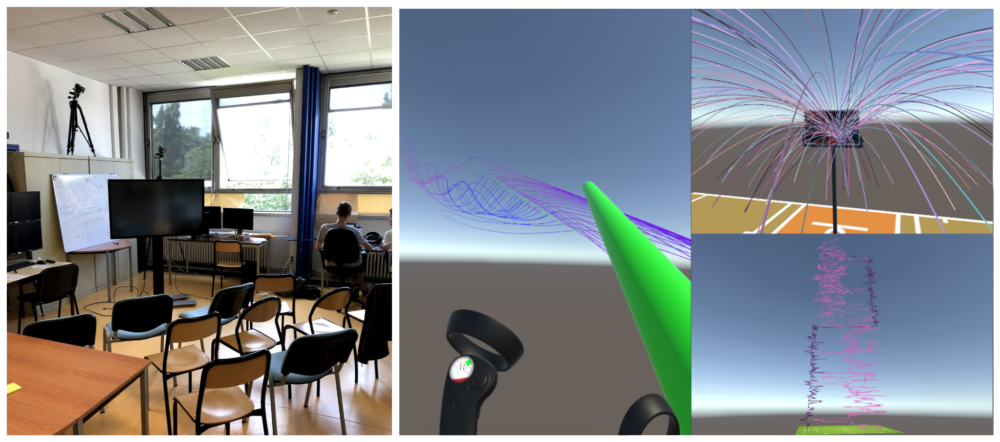

 

---
layout: page
title: About
permalink: /about/
---



*The **Amigo platform** is an experimental platform for the analysis of motion data (GPS extracts, video streams, sensors, etc.). The particularity of the platform is to allow an end-to-end analysis, from capture to data visualization.*

Amigo is hosted by [Ecole Centrale de Lyon](https://www.ec-lyon.fr/).

